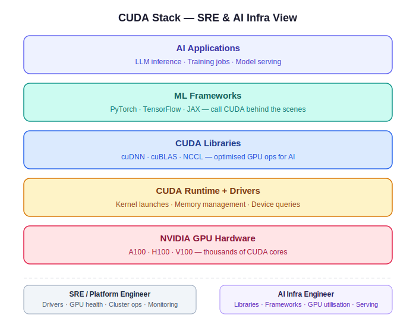

# CUDA for SRE & AI Infra Engineers

> **Audience:** SREs and platform engineers working with GPU infrastructure — not ML researchers or CUDA kernel developers.

---

## TL;DR

- **CUDA** = NVIDIA's platform for running general compute workloads on GPUs (not just graphics)
- **As an SRE:** you manage drivers, monitor GPU health, handle OOM incidents, keep the fleet running
- **As an AI Infra engineer:** you optimise GPU utilisation, manage CUDA versions in images, tune model serving
- You will rarely write CUDA code — but you need to understand the stack to debug it

---

## 1. Mental Model — The CUDA Stack

Think of CUDA like the OS for your GPU. Just as Linux sits between your app and the CPU hardware, CUDA sits between AI frameworks and the GPU.

```
┌─────────────────────────────────────────┐
│         AI Applications                 │  ← LLM inference, training jobs
├─────────────────────────────────────────┤
│         ML Frameworks                   │  ← PyTorch, TensorFlow, JAX
├─────────────────────────────────────────┤
│         CUDA Libraries                  │  ← cuDNN, cuBLAS, NCCL
├─────────────────────────────────────────┤
│         CUDA Runtime + Drivers          │  ← Kernel launches, memory mgmt
├─────────────────────────────────────────┤
│         NVIDIA GPU Hardware             │  ← A100, H100, V100
└─────────────────────────────────────────┘
```




### Key CUDA libraries to know

| Library | What it does | Who uses it |
|---------|-------------|-------------|
| **cuDNN** | GPU-accelerated deep learning ops (convolutions, attention) | PyTorch, TensorFlow under the hood |
| **cuBLAS** | GPU matrix multiplication | Core of all LLM math |
| **NCCL** | Multi-GPU communication (all-reduce, broadcast) | Distributed training |
| **cuRAND** | Random number generation on GPU | Sampling in inference |
| **Thrust** | GPU parallel algorithms (sort, scan) | Data pipelines |

---

## 2. SRE Responsibilities

### 2.1 Driver & Toolkit Version Management

This is the #1 operational headache. CUDA has **two** version numbers:

- **Driver version** — installed at the OS/host level (e.g. `535.54.03`)
- **Toolkit version** — what your code compiles/runs against (e.g. `12.2`)

**They must be compatible.** The driver must support the toolkit version or higher.

```
Error: CUDA driver version is insufficient for CUDA runtime version
```
This error = driver too old for the toolkit version in the container.

**Compatibility table shortcut:**  
https://docs.nvidia.com/cuda/cuda-toolkit-release-notes/index.html

**In Kubernetes:** The host node driver is shared across all GPU pods. You cannot have different driver versions on the same node.

### 2.2 Monitoring GPU Health

#### Quick checks with nvidia-smi

```bash
# Full status of all GPUs
nvidia-smi

# Live monitoring (refresh every 1 second)
watch -n1 nvidia-smi

# Check driver version
nvidia-smi --query-gpu=driver_version --format=csv,noheader

# GPU temperature, power, memory — CSV format for scripting
nvidia-smi --query-gpu=index,name,temperature.gpu,power.draw,memory.used,memory.total \
  --format=csv,noheader,nounits

# Check for GPU errors (XID errors = hardware issues)
nvidia-smi --query-gpu=ecc.errors.corrected.volatile.total,ecc.errors.uncorrected.volatile.total \
  --format=csv
```

#### Key metrics to monitor

| Metric | Healthy range | Alert threshold |
|--------|--------------|-----------------|
| Temperature | < 80°C | > 85°C |
| Memory used | depends on workload | > 95% of total |
| Power draw | varies by GPU model | sustained at TDP limit |
| ECC uncorrected errors | 0 | any > 0 = hardware fault |
| SM utilisation | > 70% for training | < 20% during active job = bottleneck |

#### At scale — DCGM (Data Center GPU Manager)

For fleets of GPU nodes, use NVIDIA DCGM instead of `nvidia-smi`:

```bash
# Install DCGM
apt-get install datacenter-gpu-manager

# Run diagnostics
dcgmi diag -r 1    # Quick health check
dcgmi diag -r 3    # Full diagnostic (takes ~10 mins)

# Check GPU topology (how GPUs are connected)
dcgmi topo -m
```

DCGM exports Prometheus metrics — standard setup in AI clusters:

```yaml
# dcgm-exporter in Kubernetes (Helm)
helm install dcgm-exporter gpu-helm-charts/dcgm-exporter \
  --namespace monitoring
```

Key Prometheus metrics from DCGM:

```
DCGM_FI_DEV_GPU_TEMP          # Temperature
DCGM_FI_DEV_POWER_USAGE       # Power draw (watts)
DCGM_FI_DEV_FB_USED           # Framebuffer (VRAM) used
DCGM_FI_DEV_GPU_UTIL          # SM utilisation %
DCGM_FI_DEV_XID_ERRORS        # Hardware errors (any > 0 = alert)
```

### 2.3 Kubernetes GPU Setup

```yaml
# Request a GPU in a pod spec
resources:
  limits:
    nvidia.com/gpu: 1   # Number of GPUs

# NEVER set memory limits on GPU — it doesn't work that way
# GPU memory is managed by CUDA, not Kubernetes
```

**NVIDIA device plugin** must be installed on the cluster:

```bash
kubectl apply -f https://raw.githubusercontent.com/NVIDIA/k8s-device-plugin/main/deployments/static/nvidia-device-plugin.yml

# Verify GPUs are visible
kubectl describe node <node-name> | grep nvidia
```

**Check which pods are using GPUs:**

```bash
kubectl get pods -A -o json | jq '.items[] | 
  select(.spec.containers[].resources.limits."nvidia.com/gpu" != null) |
  {name: .metadata.name, ns: .metadata.namespace}'
```

### 2.4 Checking CUDA versions

```bash
# CUDA toolkit version (inside a container or on host)
nvcc --version

# Alternative — works even without nvcc installed
cat /usr/local/cuda/version.txt

# Driver version (host only)
cat /proc/driver/nvidia/version

# Runtime version from Python (inside a training container)
python3 -c "import torch; print(torch.version.cuda)"
```

---

## 3. AI Infra Engineer Responsibilities

### 3.1 Docker Images — CUDA Base Images

Always pin your CUDA version explicitly. Never use `:latest`.

```dockerfile
# Standard pattern — nvidia/cuda official images
FROM nvidia/cuda:12.2.0-cudnn8-runtime-ubuntu22.04

# Tags follow the pattern:
# cuda:<version>-cudnn<version>-<runtime|devel|base>-<os>
#
# runtime  = includes CUDA runtime libs (for inference)
# devel    = includes compiler + headers (for building)
# base     = minimal — just CUDA, nothing else
```

**Image size guide:**
- `base` (~200MB) — use when you only need GPU access
- `runtime` (~1.5GB) — use for running pre-built models
- `devel` (~4GB+) — use when compiling custom CUDA ops

### 3.2 GPU Utilisation — What to Measure

A GPU at 30% utilisation during a training job is burning money. Common causes:

| Symptom | Likely cause | Fix |
|---------|-------------|-----|
| Low SM util, low memory | CPU data pipeline bottleneck | Increase DataLoader workers, prefetch |
| High memory, low SM util | Batch size too small | Increase batch size |
| SM util spiky, not steady | Synchronisation overhead | Profile with `torch.profiler` |
| Memory full, util low | Memory leak or fragmentation | Restart, check for tensor accumulation |

**Quick GPU utilisation check:**

```bash
# Watch SM utilisation and memory
nvidia-smi dmon -s um -d 1
# -s um = utilisation + memory
# -d 1  = every 1 second
```

### 3.3 Profiling Tools

```bash
# PyTorch built-in profiler (inside training code)
with torch.profiler.profile(
    activities=[torch.profiler.ProfilerActivity.GPU],
    record_shapes=True
) as prof:
    model(input)
print(prof.key_averages().table(sort_by="cuda_time_total", row_limit=10))

# NVIDIA Nsight Systems — system-level GPU profiling
nsys profile -o report python train.py
nsys-ui report.nsys-rep  # Open in GUI

# NVIDIA Nsight Compute — kernel-level profiling
ncu --target-processes all python train.py
```

### 3.4 Multi-GPU Setups

**Terminology:**

| Term | Meaning |
|------|---------|
| **Data parallelism** | Same model on N GPUs, different data batches |
| **Tensor parallelism** | Model layers split across GPUs (for huge models) |
| **Pipeline parallelism** | Different layers on different GPUs |
| **NVLink** | Fast GPU-to-GPU interconnect (within node) |
| **NCCL** | Software library for GPU collective operations |
| **InfiniBand** | Fast network for GPU-to-GPU across nodes |

**Check GPU interconnect topology:**

```bash
nvidia-smi topo -m
# P2P = direct peer-to-peer access (fast)
# SYS = goes through system memory (slow)
# NV# = NVLink connections (fastest)
```

---

## 4. Common Incidents

### OOM — Out of GPU Memory

```
RuntimeError: CUDA out of memory. Tried to allocate X GiB
```

**Immediate steps:**
1. Check which process is using GPU memory: `nvidia-smi`
2. Kill the offending process if stuck: `kill -9 <pid>`
3. Clear PyTorch cache if needed: `torch.cuda.empty_cache()` (in Python)

**Prevention (AI Infra side):**
- Set `--gpu-memory-fraction` or equivalent in serving frameworks
- Use vLLM's PagedAttention for LLM serving (drastically reduces fragmentation)
- Monitor with `DCGM_FI_DEV_FB_USED` alert at 90% threshold

### Driver/Toolkit Mismatch

```
CUDA driver version is insufficient for CUDA runtime version
```

**Fix:**
1. Check driver: `nvidia-smi | head -3`
2. Check toolkit needed: look at the base image tag in the Dockerfile
3. Either upgrade the driver on the host OR downgrade the CUDA version in the image

### XID Errors — Hardware Issues

```bash
# Check kernel logs for XID errors
dmesg | grep -i "xid"
nvidia-smi --query-gpu=ecc.errors.uncorrected.volatile.total --format=csv
```

Common XID codes:

| XID | Meaning | Action |
|-----|---------|--------|
| 48 | Double-bit ECC error | Replace GPU |
| 79 | GPU hung | Reboot node |
| 92 | High single-bit ECC errors | Monitor, plan replacement |
| 94 | Contained channel error | Drain node, check hardware |

### GPU Not Visible in Container

```bash
# Container doesn't see GPUs?
# 1. Check nvidia-container-runtime is installed
docker info | grep -i runtime

# 2. Run container with GPU access
docker run --gpus all nvidia/cuda:12.2.0-base-ubuntu22.04 nvidia-smi

# 3. In Kubernetes — check device plugin is running
kubectl get pods -n kube-system | grep nvidia
```

---

## 5. Quick Reference Card

```bash
# ── Status & Health ───────────────────────────────────
nvidia-smi                          # Full GPU status
watch -n1 nvidia-smi               # Live view
nvidia-smi dmon -s um -d 1         # Utilisation + memory stream
dcgmi diag -r 1                    # Quick health check

# ── Version Checks ────────────────────────────────────
nvidia-smi | head -3               # Driver version
nvcc --version                     # CUDA toolkit version
cat /usr/local/cuda/version.txt    # Alternative toolkit check

# ── Memory & Processes ───────────────────────────────
nvidia-smi pmon                    # Per-process GPU usage
nvidia-smi --query-compute-apps=pid,used_memory --format=csv

# ── Topology ──────────────────────────────────────────
nvidia-smi topo -m                 # GPU interconnect map

# ── Errors ────────────────────────────────────────────
dmesg | grep -i xid                # Hardware XID errors
nvidia-smi --query-gpu=ecc.errors.uncorrected.volatile.total --format=csv

# ── Kubernetes ────────────────────────────────────────
kubectl describe node <node> | grep nvidia    # Node GPU capacity
kubectl get pods -A | grep gpu               # GPU pods
```

---

## 6. Further Reading

- [NVIDIA CUDA Documentation](https://docs.nvidia.com/cuda/)
- [DCGM Documentation](https://docs.nvidia.com/datacenter/dcgm/latest/)
- [NVIDIA Container Toolkit](https://docs.nvidia.com/datacenter/cloud-native/container-toolkit/overview.html)
- [Kubernetes GPU support](https://kubernetes.io/docs/tasks/manage-gpus/scheduling-gpus/)
- [vLLM — LLM serving](https://docs.vllm.ai/)
